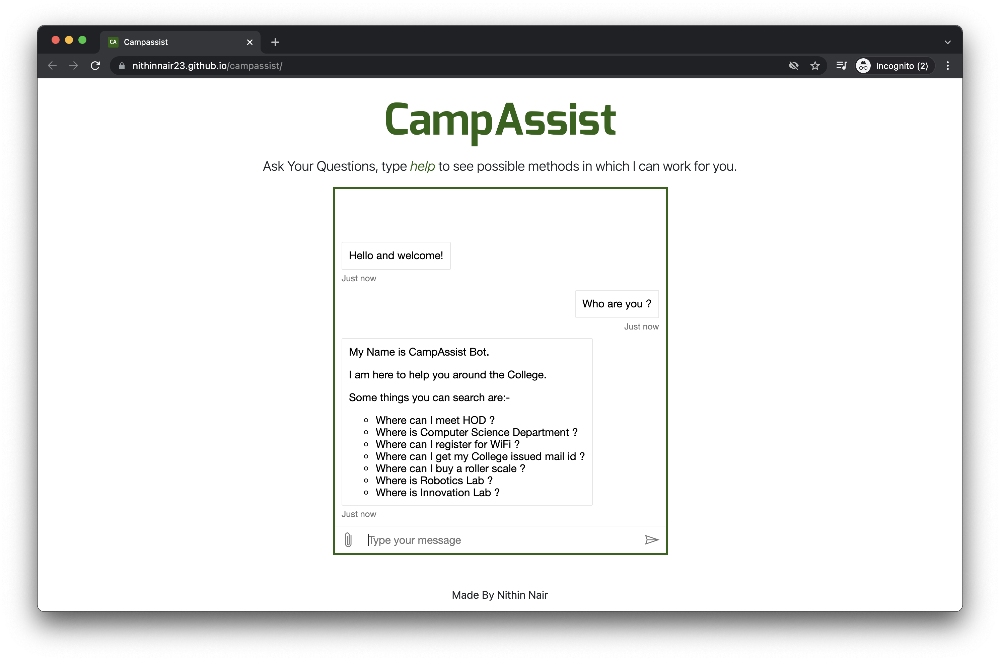
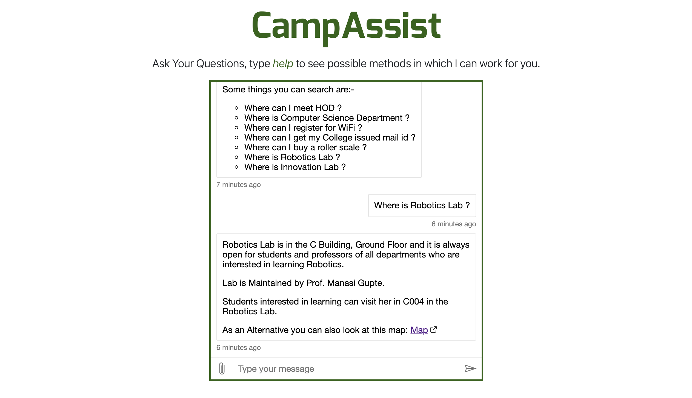

Campassist Bot is a ChatBot which is a modern method to introduce freshers and guests to a College Campus. As this is an education project, I have planned to create project to guide users through an imaginary College Campus.
The Chatbot will be made using the **QnA Maker Service of Microsoft Azure** and will use a knowledge base created specifically to answer questions and all possible permutations of a set of questions.
The Knowledge Base created using ***QnA Maker Service*** is connected with the **Web App Bot service of Microsoft Azure**
The Chatbot will then be deployed onto a website that I will host using the ***Static Web Apps service of Microsoft Azure*** .

# Steps Taken:-
- Created a Resource Group on Azure
- Created a QnA Service
- Created a new Knowledge Base and connected that with previously created QnA Service.
- Wrote possible questions and relating answers, Also used multi-turn answers provided by Microsoft Azure QnA Maker service.
- Published the QnA Maker Knowledge Base and created a Web App Bot
- From Channels took code to embed into a static HTML webpage.
- Created Maps of Imaginary Campus and internal maps of each important building, and added webpages to make it easier to navigate around college.
- Created a new repository in Github and using Github pages deployed website onto: https://nithinnair23.github.io/campassist

# Additional Steps Taken on 31st January 2022:-
- Created a Static Web app resource group.
- Connected it with my GitHub Account, Organisation and then required Repository.
- Then Deployed it onto Microsoft Azure Static Apps Website: https://white-mud-0a22d4710.1.azurestaticapps.net/

# Additional Data:- 
- This project uses
  - QnA Maker Service (and Knowledge Bases)
  - The *index.html* file has the code of Web App Bot taken from Channels Tab in the Web App Bot Service. This code is an embedded code that is provided from Web App Bot Azure services' Portal itself.
  - Static Web Apps Azure Service: Azure Static Web Apps is a service that automatically builds and ***deploys full stack web apps to Azure*** from a code repository
- Deployment Details and App Demonstration Video Link: https://youtu.be/rJiNsBWZclQ

Output Images:-

